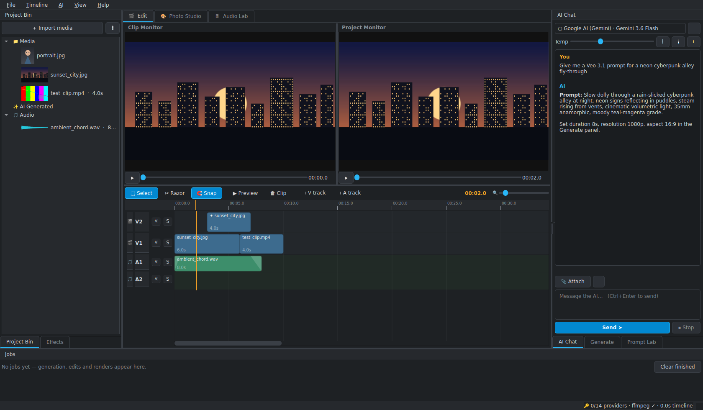
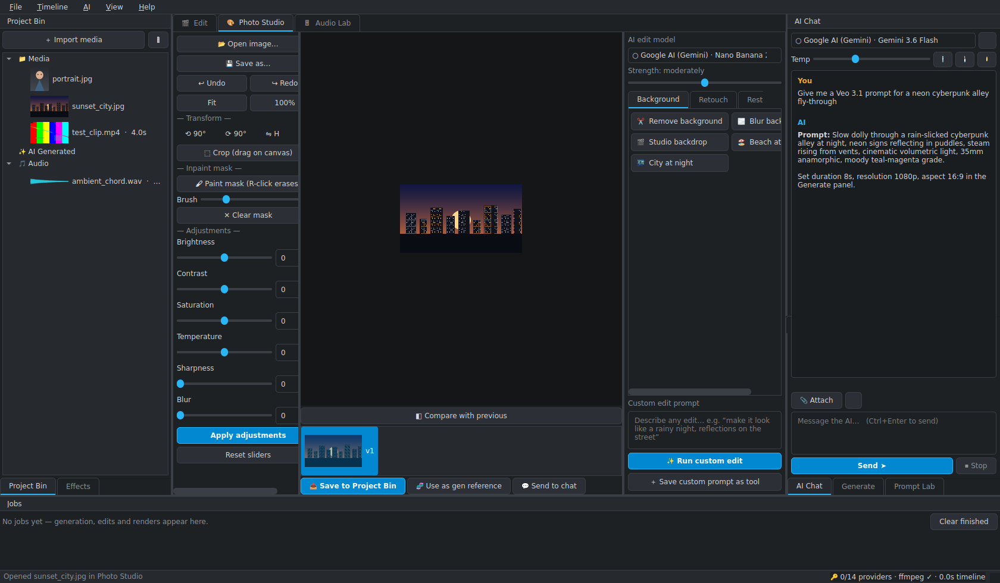
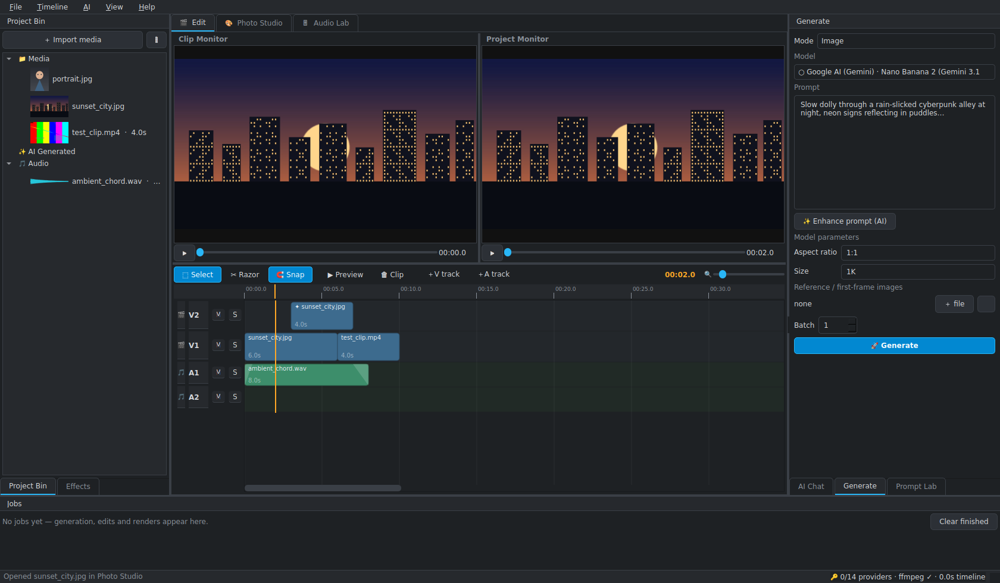

# PrismCut Studio

**Open-source AI photo, video & audio studio — bring your own API keys.**

A native desktop app (Qt, ships as a Windows `.exe`) that fuses a
Kdenlive-style editing workflow with the latest generative AI APIs: chat with
any model, generate and edit images with one-click **Nano Banana** tools, render
video with **Veo 3.1 / Sora 2 / Grok Imagine / Hailuo 03 / Seedance 2.0**, and
score it with **ElevenLabs / MiniMax / Suno** music — all from a multi-track
timeline with audio mixing and ffmpeg export.





> UI layout inspired by the excellent [Kdenlive](https://kdenlive.org).
> Clean-room implementation — no Kdenlive code or assets are used, which is
> what lets PrismCut be MIT-licensed.

---

## Features

**Editing**
- Multi-track timeline (video V1/V2…, audio A1/A2…, add as many as you like) with drag, trim, razor, snapping, zoom, per-track mute/solo and a scrub preview player
- Dual monitors (clip / project), project bin with thumbnails and drag-and-drop import
- Per-clip effects rendered by ffmpeg on export: transform, opacity, color, blur, speed, plus audio gain/fades
- Export presets: 1080p / 4K / vertical / square, H.264, HEVC, VP9/WebM, GIF, PNG sequence, MP3/WAV audio mixdown
- Photo Studio: crop, rotate/flip, brightness/contrast/saturation/temperature/sharpen/blur, inpaint **mask brush**, version filmstrip with A/B wipe compare

**AI (bring your own keys — the app works with any subset)**
- **Nano Tools**: ~25 prefilled one-click AI edits (remove background, relight golden hour, restore old photo, colorize, magic eraser, cartoonify, product shot, outpaint…) that send your image + prompt to the selected edit model — Nano Banana by default; add your own tools without code
- **Generate panel**: text→image, text/image→video, music, SFX and speech with *full parameter control* — every model exposes its own tuned form (seed, aspect, resolution, duration, CFG, negative prompt, style presets, reference/first-frame images, batch variants)
- **Prompt Lab**: templates with `{variables}`, style-tuning token groups (lighting, lens, mood, color), live preview, prompt history, one-click "Enhance with AI"
- **AI Chat**: full chat panel with a model toggle populated from every configured provider, streaming responses, system prompt + temperature, saved conversations, and image/audio/video attachments encoded correctly per provider
- **Audio Lab**: mixer (faders/pan/mute/solo), waveforms, normalize, fades, plus AI TTS voices, music generation, sound effects and transcription straight into the bin

**Provider adapters (13 + custom)**

| Provider | Chat | Image gen | Image edit | Video | TTS | Music | SFX | STT |
|---|---|---|---|---|---|---|---|---|
| Google AI (Gemini · Nano Banana · Veo) | ✅ | ✅ | ✅ | ✅ | ✅ | — | — | ✅ |
| OpenAI (GPT · gpt-image · Sora 2) | ✅ | ✅ | ✅ | ✅ | ✅ | — | — | ✅ |
| Anthropic Claude | ✅ | — | — | — | — | — | — | — |
| xAI (Grok · Grok Imagine) | ✅ | ✅ | — | ✅ | — | — | — | — |
| DeepSeek | ✅ | — | — | — | — | — | — | — |
| MiniMax (Hailuo 03 "H3" · Music · Speech) | ✅ | — | — | ✅ | ✅ | ✅ | — | — |
| Seedance 2.0 (BytePlus Ark) | — | — | — | ✅ | — | — | — | — |
| Stability AI | — | ✅ | ✅ | — | — | — | — | — |
| Black Forest Labs (FLUX 2 · Kontext) | — | ✅ | ✅ | — | — | — | — | — |
| fal.ai (aggregator: Kling, WAN, LTX…) | — | ✅ | ✅ | ✅ | — | ✅ | — | — |
| Replicate (aggregator) | — | ✅ | — | ✅ | — | ✅ | — | — |
| ElevenLabs | — | — | — | — | ✅ | ✅ | ✅ | — |
| Suno (community gateway, experimental) | — | — | — | — | — | ✅ | — | — |
| Custom OpenAI-compatible (OpenRouter, Groq, Ollama…) | ✅ | — | — | — | — | — | — | — |

Model IDs are **data, not code**: `prismcut/assets/models.json` ships verified
defaults (Aug 2026 — Gemini 3.x, Nano Banana 2/Pro, Veo 3.1, GPT-5.6, Sora 2,
Grok Imagine Video 1.5, MiniMax-H3, Seedance 2.0, FLUX 2…) and the in-app
**Model Manager** adds/overrides models the day new ones launch. *"Omni Flash"*-
style fast multimodal models are covered by the Gemini Flash family and the
GPT omni line; anything else is one Model Manager entry away.

---

## Quick start (from source)

```bash
git clone https://github.com/YOURNAME/prismcut-studio
cd prismcut-studio
python -m pip install -r requirements.txt
python -m prismcut
```

Requirements: Python 3.10+, [ffmpeg](https://ffmpeg.org/download.html) on PATH
for export/waveforms (`winget install Gyan.FFmpeg` on Windows). The app runs
without ffmpeg; export and waveforms are disabled until it is installed.

### Drop in your keys

Open **AI ▸ API Keys…** (Ctrl+K). Each provider row links to its key page —
paste the key, hit *Test*, done. Any subset works; panels only list models
whose capability exists, marking keyed providers with 🔑. Environment
variables (`GEMINI_API_KEY`, `OPENAI_API_KEY`, `XAI_API_KEY`,
`MINIMAX_API_KEY`, `FAL_KEY`, …) override stored keys.

> 🔒 Keys are stored locally (OS keyring when available, else app settings,
> obfuscated not encrypted) and are only ever sent to that provider's own API.
> The app makes no other network calls. It's open source — audit `providers/`.

## Windows .exe

**Download:** grab `PrismCut-windows-x64.zip` from
[Releases](../../releases) (built automatically by GitHub Actions on every
tag — no toolchain needed).

**Build it yourself** on Windows (one command):

```bat
packaging\build_windows.bat
```

→ `dist\PrismCut\PrismCut.exe`. Or trigger the *Build Windows EXE* workflow
from the Actions tab and download the artifact.

---

## Architecture

```
prismcut/
├── core/          settings & key vault · model registry · job queue ·
│                  ffmpeg media probe/thumbs · project model · export renderer
├── providers/     one adapter per provider implementing a common contract:
│                  chat / generate_image / edit_image / generate_video /
│                  tts / music / sound_effect / transcribe  (Qt-free, testable)
├── ui/            Qt widgets: main window, timeline, monitors, project bin,
│                  Photo Studio + Nano Tools, Generate, Prompt Lab, Chat,
│                  Audio Lab, Effects, Jobs, dialogs (keys / models / export)
└── assets/        models.json · nano_tools.json · prompt_templates.json
```

- Everything long-running (API calls, polling, renders) runs in the **job
  queue** with progress + cancel — the UI never blocks.
- Media in/out is handled per provider: base64 inline data for Gemini,
  multipart for OpenAI edits/Whisper, data-URIs for fal/MiniMax first-frames,
  hex-decoding for MiniMax audio, signed-URL downloads for FLUX/Veo/Sora.
- Projects save as JSON (`.pcut`), media stays referenced in place; generated
  assets land in the app data dir and the bin's *AI Generated* group.

## Roadmap

Full-sequence realtime playback (compositing preview), keyframed effects,
proper LUFS loudness normalization, SRT/caption editor with per-segment
timings, per-clip pan law, proxy editing, plugin system for community
providers, macOS/Linux packages.

## Contributing

PRs welcome — see [CONTRIBUTING.md](CONTRIBUTING.md).
Provider adapters are ~100 lines each; adding one is a great first PR.

## License

[MIT](LICENSE). Kdenlive inspired the layout but no GPL code is used.
You pay AI providers directly at their rates; generated content is subject to
each provider's terms.
